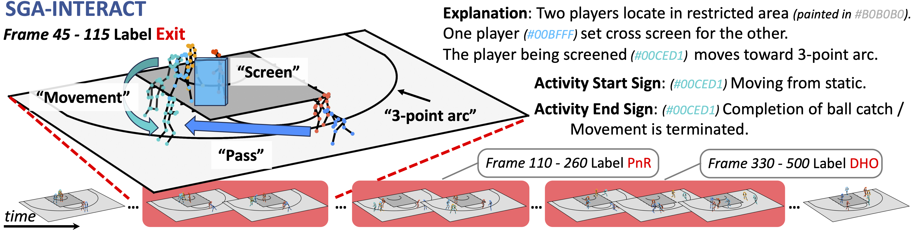

# SGA-INTERACT: A 3D Skeleton-based Benchmark for Group Activity Understanding in Modern Basketball Tactic

#### <p align="center">[arXiv Paper](TBD) | [Download Dataset](https://drive.google.com/file/d/1OcWDqdCHD5fxTXz_3Tdtq6wY9yFw-J0i/view?usp=sharing)</p>

# 


#
<p align="center">
  
  
</p>
<p align="center">
  
  
</p>

## Installation
Refer to [INSTALLATION.md](doc/INSTALLATION.md)

## SGA-INTERACT Data

Refer to [DATASET.md](doc/DATASET.md) for data structure details.

## SGA-INTERACT Baselines
Refer to [BASELINES.md](doc/BASELINES.md) 

## Citation
If you find this work useful in your research, please consider citing:
```
TBD
```

## Acknowledgement
We thank the authors of [ST-GCN](https://github.com/open-mmlab/mmskeleton), [ST-GCN Pytorch](https://github.com/liyaguang/st-gcn/tree/master), [COMPOSER](https://github.com/hongluzhou/composer), [MPGCN](https://github.com/mgiant/MP-GCN/blob/main/README.md), [DIN](https://github.com/JacobYuan7/DIN-Group-Activity-Recognition-Benchmark), [ActionFormer](https://github.com/happyharrycn/actionformer_release) for their great works. We partially refer to their codebases for this project.
